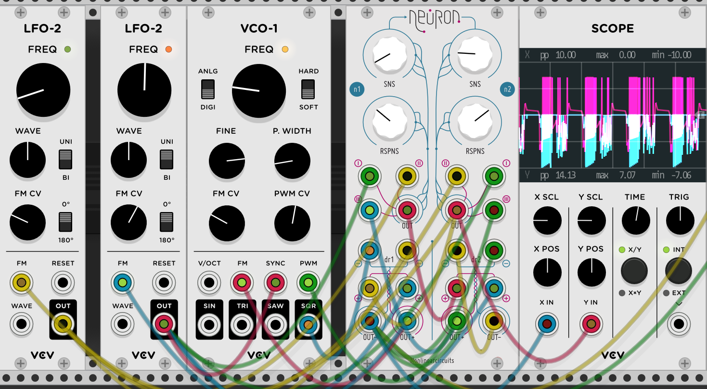

# Nonlinear Circuits
These are ports of the incredible Nonlinear Circuits Eurorack modules for [VCV Rack](https://vcvrack.com/). Many of these ports were originally made for Euro Reakt for Reaktor 6, and were created by analyzing real hardware builds.

Modules by [Nonlinear Circuits](http://nonlinearcircuits.blogspot.com/) are typically smaller modules that focus on surprises through simple interaction. They are highly recommended as starter DIY Eurorack builds.

## Credits
- Original Design: [Andrew Fitch](http://nonlinearcircuits.blogspot.com/)
- Code: [Michael Hetrick](https://mhetrick.com/)
- Double Neuron Panel: [Papernoise](https://www.papernoise.net/) (Hannes Pasqualini)
- Panel Porting: Jason Wehmhoener

## Modules

### Double Neuron
This is based off of a special panel designed by [Papernoise and sold by Magpie Modular](https://magpie-modular.myshopify.com/collections/all-panels/products/nonlinear-circuits-dual-neuron?variant=31017400707). It is a panel meant to house two separate Neuron/Diff-Rect modules. Why two? Well, they're easy to build and they interact in a spectacular way.

The top-half is a "Neuron" circuit. This is a three-input mixer that runs into a half-wave rectifier and comparator. The comparator's bipolar output is summed with the rectified signal. SENSE adds a positive DC signal to the mix, while RESPONSE affects the magnitude of the comparator's output. The values of the knobs here are accurate to the original hardware, and are not bipolar like the Euro Reakt port.

The Diff-Rect (Difference Rectifier) is another creative mixer. The two "+" inputs are summed together, and the two "-" inputs are summed together. The "-" mix is then subtracted from the "+" mix. If the result is positive, it goes out the "+" output, otherwise it goes out the "-" output.

If this seems complicated, just experiment! These modules were designed for fun, not for rigorous analysis.

### Coming Soon
- BOOLs
- Squid Axon
- 8-Bit Cipher
- Divine CMOS
- BOOLs
- Numberwang
- Segue
- Let’s Splosh
- GENiE
- 1050 MixSeq
- 32:1
- Router
- Divide and Conquer
- Statues
- 4Seq
- Single Neuron/Diff-Rect