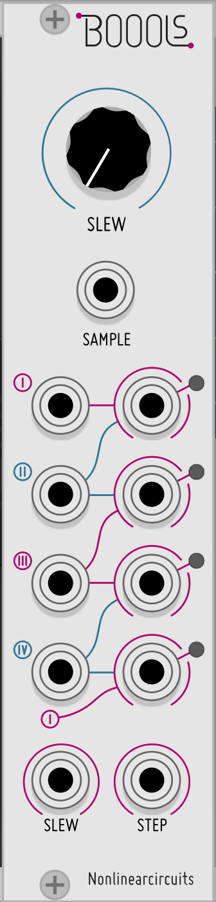

# Nonlinear Circuits
These are ports of the incredible Nonlinear Circuits Eurorack modules for [VCV Rack](https://vcvrack.com/). Many of these ports were originally made for Euro Reakt for Reaktor 6, and were created by analyzing real hardware builds.

Modules by [Nonlinear Circuits](https://www.nonlinearcircuits.com/) are typically smaller modules that focus on surprises through simple interaction. They are highly recommended as starter DIY Eurorack builds.

Recommended viewing: [Interview with Nonlinear Circuits by Music Thing Modular](https://www.youtube.com/watch?v=NxVBmO7cJFA)

## Credits
- Original Design: [Andrew Fitch](https://www.nonlinearcircuits.com/)
- Code: [Michael Hetrick](https://mhetrick.com/)
- Double Neuron, Let's Splosh!, and BOOLs Panels: [Papernoise](https://www.papernoise.net/) (Hannes Pasqualini)
- Squid Axon panel: Jason Wehmhoener
- 4Seq, GENiE, Neuron, Statues, Numberwang panels: jk

## Modules

### Double Neuron
This is based off of a special panel designed by [Papernoise and sold by Magpie Modular](https://magpie-modular.myshopify.com/collections/all-panels/products/nonlinear-circuits-dual-neuron?variant=31017400707). It is a panel meant to house two separate Neuron/Diff-Rect modules. Why two? Well, they're easy to build and they interact in a spectacular way.

[Video intro by Modular Addict](https://www.youtube.com/watch?v=2T5mkvdE-fc)

The top-half is a "Neuron" circuit. This is a three-input mixer that runs into a half-wave rectifier and comparator. The comparator's bipolar output is summed with the rectified signal. SENSE adds a positive DC signal to the mix, while RESPONSE affects the magnitude of the comparator's output. The values of the knobs here are accurate to the original hardware, and are not bipolar like the Euro Reakt port.

The Diff-Rect (Difference Rectifier) is another creative mixer. The two "+" inputs are summed together, and the two "-" inputs are summed together. The "-" mix is then subtracted from the "+" mix. If the result is positive, it goes out the "+" output, otherwise it goes out the "-" output.

If this seems complicated, just experiment! These modules were designed for fun, not for rigorous analysis.

### Squid Axon
This is a three channel mixer connected to a shift register of sorts. Unlike most shift registers, OUT 1 holds its value until OUT 4 has received its value. There are two feedback controls. OUT 4 is normalled to IN 3, so if nothing is connected to IN 3, it is a feedback input. The other feedback control is nonlinear and always available. This feedback path runs through a diode simulator, so it behaves much differently than the other feedback control.

To use: plug any signal into the CLOCK input. Whenever this signals goes above 1V, a clock will fire. Plug any other signals into IN 1 and IN 2. Keep IN 3 unplugged if you want to use the regular FEEDBACK control.

### BOOLs
This is a four channel logic jumbler. The most common way to use this would be to plug 4 gates into the 4 inputs and derive logical combinations on the outputs. However, the inputs accept any signal (audio, LFOs, envelopes, you name it) and will decide that they are active if their value is above 1 volt.

On top of the logic jumbling, the four output channels are used to create a 4-bit stepped output at the STEP jack. This output also appears at the SLEW jack, but with a variable amount of smoothing set by the SLEW control.

Finally, if a cable is plugged into the SAMPLE input, the four output gates will only change upon the reception of a trigger here. This is useful for enforcing a more rigid tempo upon the outputs.

Right-click on the panel to select the active logic mode: OR, AND, XOR, NOR, NAND, XNOR

### Let's Splosh
This is a 4-input, 16-output master of signal jumbling. Essentially, four inputs are used in 8 different Diff-Rects (see the description under the Neuron above). The left half of the module contains the positive outputs, while the right half is negative. Try throwing in four LFOs of different frequencies as a starter patch. It's a lot of fun!

### 4Seq
This is a simple sequencer with a deceiving amount of depth. There are two sequences: X and Y. Y is always the opposite step of X and counting in the opposite direction (so if X is step 0, Y is step 3; if X is step 1, Y is step 2). There is a gate input that reverses the count direction while the gate is above 1V. Finally, the bottom section is a clock divider that divides the incoming clock. Try plugging the clock divider's outputs into the direction input!

### GENiE
If you thought the Double Neuron was crazy, this is essentially a triple Neuron pre-patched with a feedback network. The outputs of the three neurons are normalled to each other's inputs (as indicated on the panel). Those inputs have an additional IN control on top to control the gain. Because of the extreme amount of feedback, changing VCV's sampling rate can wildly alter the sound of this.

### Statues
This is a 1-in 8-out switch with two major twists. First, the output is determined by the state of three gate inputs. These gate inputs essentially create a 3-bit integer (1 through 8) to choose the output. Second, when an output becomes inactive, it holds its previous value. This can be a lot more useful than a switch where a modulation output is suddenly dropped to zero!

### Numberwang
Four gate inputs make 16 gate outputs. That's Numberwang!
Each of the four gate outputs represents a bit in a 4-bit number (1-16). Depending on the values of the incoming gates, the corresponding output gate on the matrix will be active. Try plugging in four LFOs at different frequencies and watch the patterns.

### Segue
This module is very similar to HetrickCV's Flip Pan. It pans two input signals by flipping their channels (i.e. the left input is panned right, the right input is panned left). This sounds simple, but it is very versatile.

- Plug one signal in and monitor both outputs to use this as a traditional panner.
- Plug two signals in and monitor only one output to use this as a crossfader.
- Plug one signal in and monitor the opposite output to use this as a VCA.

### 8-Bit Cipher
This is a massive chunk of unpredictability, somewhat like a deluxe Turing Machine. [Original description from NLC.](https://www.nonlinearcircuits.com/modules/p/8bit-cipher)

### Divine CMOS
A complicated subharmonic generator, or clock divider, or weird sequencer. Essentially, send a signal into either input (audio or gates). The main OUT is a mix of four clock dividers, the gain of each is controlled by the knobs. With a predictable clock signal into only one of the inputs, you can treat this output as a stepped sequencer. The SLEW output is the same signal as OUT, except with a variable amount of slew controlled by the SLEW knob. The bottoms four outputs are dedicated clock dividers that are not affected by the gain controls.

Here's where things get hairy: with two signals plugged in, the clock divider outputs are now the logical XOR of the divisions of the two incoming signals. Essentially, this is a 1-bit ring modulator. Just experiment and have fun. If you're using this for audio, be sure to run the output through a DC Blocker (or a high pass filter set to around 20 Hz) to remove any offset, as the outputs are all unipolar.

### Future Additions
- 1050 MixSeq
- 32:1
- Router
- Divide and Conquer

